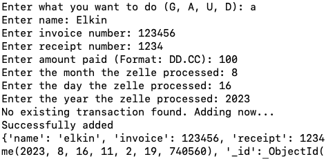

# Transaction Tracker (Python + MongoDB)

Transaction Tracker is a Python project that allows users to manage transactions in a MongoDB database. 

## Installation

1. Install the `pymongo` Python library: 
`pip install pymongo`

2. Configure the `.ini` file:
Create a configuration `.ini` file with sensitive information such as local database connection details.

3. Configure the `keys/credentials.json` file with sensitive information such as cloud database connection details.

## Usage

Intended for developer use only (built to lay the groundwork for the Transaction Tracker API)

1. Run `python3 main.py` in the command line to start using the Transaction Tracker:

2. Use key inputs to access different features in program:  
 `G`: for retrieving transactions  
 `A`: for adding transactions  
 `U`: for updating transactions  
 `D`: for deleting transactions  

3. Follow the rest of the program instructions to execute commands

### Example

## Features

- Easily manage transactions from command line: Add, update, delete, and retrieve transactions in a MongoDB database.
- Prevent duplicate postings: Communicate with the MongoDB database to avoid duplicate transactions.
- Efficient tracking: Track and manage posted transactions for better financial management.

## Contact Information

For questions, feedback, or inquiries, please contact the project owner at [elkingarcia.11@gmail.com](mailto:elkingarcia.11@gmail.com).

## Acknowledgments

- This project utilizes [PyMongo](https://pymongo.readthedocs.io/), a Python distribution containing tools for working with MongoDB.

## Roadmap

The Transaction Tracker project served as the blueprint for the Transaction Tracker API program I developed allowing our operations team to track the company's financial activities from their phones.